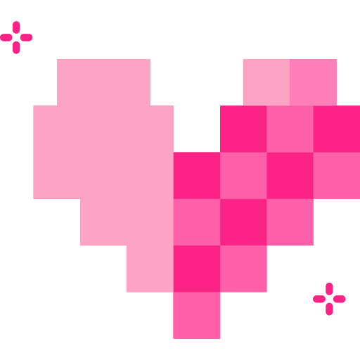
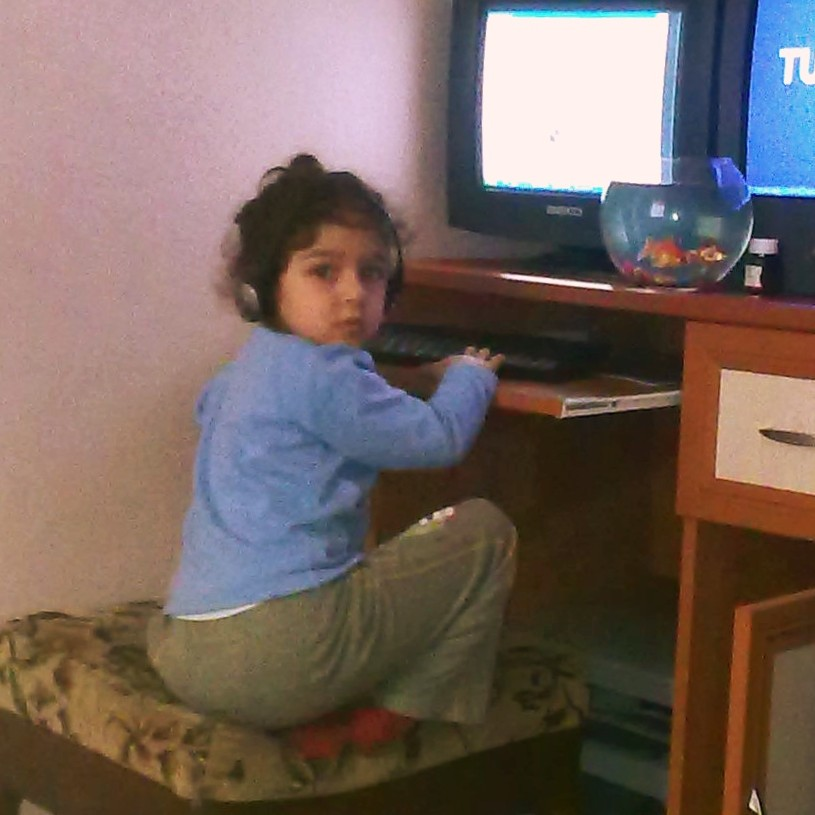

<picture>
   <source media="(prefers-color-scheme: dark)" srcset="art/newgif.gif">
   
</picture>
 

 

  

---

##  About Me

<table  width="100%" align="center">
<tr>
<td width="65%" valign="middle">

- 🎓 Studying **Computer Engineering**
- 💻 Interested in **Backend Development & Software Architecture**
- 🤖 Exploring **Artificial Intelligence & Machine Learning**
- 🌱 Currently improving my **TypeScript, Node.js & system design** skills
- ☕ Powered by turkish coffee

</td>

<td width="35%" align="center">

</td>
</tr>
</table>

---

## 🛠️ Tech Stack

---

## 📊 GitHub Statistics

---

<picture>
  <source
    media="(prefers-color-scheme: dark)"
    srcset="https://raw.githubusercontent.com/ElifRanaAkyol/ElifRanaAkyol/output/github-contribution-grid-snake-dark.svg">
  <source
    media="(prefers-color-scheme: light)"
    srcset="https://raw.githubusercontent.com/ElifRanaAkyol/ElifRanaAkyol/output/github-contribution-grid-snake.svg">
  
</picture>

---

## Connect With Me

